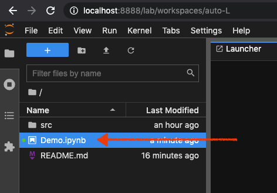
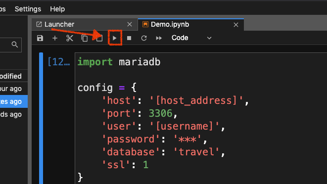

# Data Analysis and Visualization with MariaDB Connector/Python

The samples contained in this directory demonstrate how to use MariaDB Connector/Python in combination with libraries [Plotly](https://plotly.com/) and [Pandas](https://pandas.pydata.org/) to analyze and visualize data.

**Note:** This directory assumes that you've already installed the necessary requirements for using MariaDB Connector/Python. If you haven't, please refer to the root [README](../../README.md) of this repository.

## Downloading and loading data

The samples in this directory rely on flight data that is available from the United States Bureau of Transport. For more information on database preparation make sure you check out the following repository before continuing:

* [Developer Example ColumnStore Quick Start](https://github.com/mariadb-corporation/dev-example-columnstore-quickstart)

## Getting started

There are two ways to utilize MariaDB Connector/Python with Plotly and Pandas in this directory. Both options contain the same examples.

1. By executing the [Python code files](src) directly.
2. By using [Jupyter Lab](https://jupyterlab.readthedocs.io/en/stable/) to facilitate the code development, execution, and visualization.

### Prepare virtual environment

Regardless of which option you choose you will need to do the following to prepare a suitable enviroment.

1. Open a new terminal at this location and create a new [virtual environment](https://docs.python.org/3/tutorial/venv.html) using the following command:

    ```bash 
    $ python3 -m venv demo
    ```

2. Activate the virtual environment.

    ```bash
    $ . demo/bin/activate
    ```

### Using Python files directly

3. Download and install the necessary Python packages.

    ```bash
    $ pip install mariadb plotly pandas
    ```
4. Update the connection configuration in the [demo files](src) to point to a valid database instance.

    For example:

    ```python
    config = {
        'host': 'analytics-demo.mdb0001390.db.skysql.net',
        'port': 5001,
        'user': 'DB00004088',
        'password': 'Password123!,
        'database': 'travel',
        'ssl': True
    }
    ```

4. Execute the [demo](src) files.

    ```bash
    $ python src/demo_1.py
    $ python src/demo_2.py
    $ python src/demo_3.py
    $ python src/demo_4.py
    ```

    Demo_1 will output directly to the terminal, while Demo_2/3/4 will display a chart within your default browser.

### Using Jupyter Lab

3. Download and install the necessary Python packages.

    ```bash
    $ pip install mariadb plotly pandas jupyterlab
    ```

4. Install Jupyter extension to facilitate Plotly rendering.

    ```bash
    $ jupyter labextension install jupyterlab-plotly@4.14.3
    ```

5. Run Jupyter Lab.

    ```bash
    $ jupyter lab
    ```

6. Open Demo.ipynb (a Jupyter Notebook file).

<p align="center" spacing="10">
    <kbd>
        
    </kbd>
</p>

7.) Select and Jupyter Notebook cell and run.

<p align="center" spacing="10">
    <kbd>
        
    </kbd>
</p>

**Note:** Make sure you update the connection configuration! 
